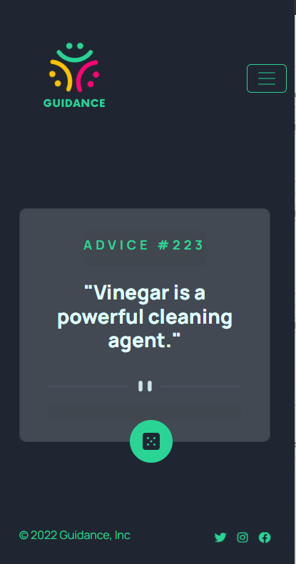

# Kingsland Module 3 Project

## Table of contents

- [Overview](#overview)
  - [Screenshot](#screenshot)
  - [Links](#links)
- [My process](#my-process)
  - [Built with](#built-with)
  - [What I learned](#what-i-learned)
  - [Continued development](#continued-development)
  - [Useful resources](#useful-resources)
- [Author](#author)

## Overview

I was inspired by [Advice generator app challenge on Frontend Mentor](https://www.frontendmentor.io/challenges/advice-generator-app-QdUG-13db). I joined Frontend Mentor because their challenges help me improve my coding skills by building realistic projects.

### Screenshot




### Links

- Solution URL: [Github Pages](https://svolcov1.github.io/advice-generator-app/)

## My process

### Built with

- Semantic HTML5 markup
- CSS custom properties
- Flexbox
- CSS Grid
- Mobile-first workflow
- [Bootstrap](https://getbootstrap.com/) - Open-source CSS framework
- [Font Awesome](https://fontawesome.com/) - Font and icon toolkit based on CSS
- [Animate.css](https://animate.style/) - For animations

### What I learned

This project allowed me to get more practice with Bootstrap and making a request and fetching a resource using the fetch() method. This was my first time using Animate.css. I will definitely be using them in the future.

See code snippets below:

```html
<!--Used fa-bounce class from Font Awesome to create bounce effect on social media icons-->
<ul class="nav col-md-4 justify-content-end list-unstyled d-flex">
  <li class="ms-3">
    <a href="#"><i class="icons fa-brands fa-twitter fa-bounce"></i></a>
  </li>
  <li class="ms-3">
    <a href="#"><i class="icons fa-brands fa-instagram fa-bounce"></i></a>
  </li>
  <li class="ms-3">
    <a href="#"><i class="icons fa-brands fa-facebook fa-bounce"></i></a>
  </li>
</ul>
```

```css
/*Change stroke color on toggler icon */
.navbar-dark .navbar-toggler-icon {
  background-image: url("data:image/svg+xml,%3csvg xmlns='http://www.w3.org/2000/svg' width='30' height='30' viewBox='0 0 30 30'%3e%3cpath stroke='rgba(42,212,149, 0.5)' stroke-linecap='round' stroke-miterlimit='10' stroke-width='2' d='M4 7h22M4 15h22M4 23h22'/%3e%3c/svg%3e");
}
```

```js
//Logo animation

const logo = document.getElementById("logo");

logo.addEventListener("mouseover", function () {
  logo.classList.add("animate__animated", "animate__hinge");
  logo.style.setProperty("--animate-duration", "2s");
  logo.style.setProperty("animation-fill-mode", "backwards");
});
```

### Continued development

I plan to redo this project using React and Vue.

### Useful resources

- [DevDocs](https://devdocs.io/) - This helped me since I was able to access multiple developer documentations with their searchable interface. This tool saved me time that I would have spent looking through mdn or w3schools.
- [Codeply](https://www.codeply.com/) - This online editor allowed me to play around with my code before adding it to my project.

## Author

- Website - [Sheneeza Volcov](https://svolcov1.github.io/html-css-module-one-project/)
